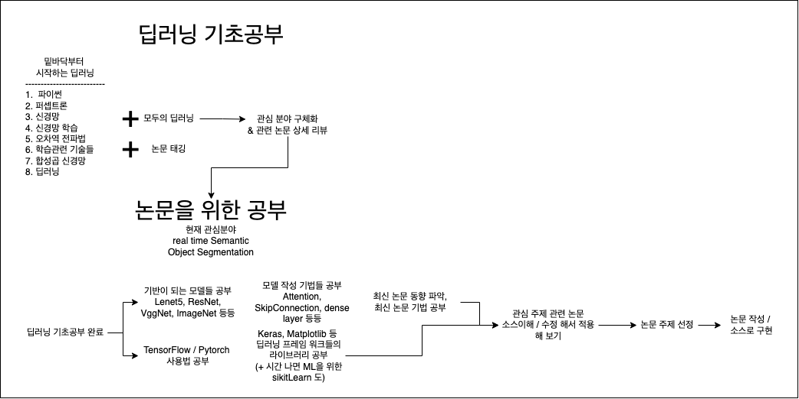

# Deep Learning Study Loadmap

---

## 하고 싶은 것
이 부분은 추후 공부를 하면서 더 추가될 수 있다.

### 1. Semantic Instance Segmentation 분야

1. Semantic Instance Segmentation  
2. ⭐️ **real time object detection** ⭐️  

> Semantic Instance Segmentation 분야 같은 경우 적용할 수 있는 분야가 넓어서 이 분야를 하고 싶었다. 또한 이 분야 안에서 특히 real time 쪽은 현재 많은 곳에서 연구중인 자율주행(특히 테슬라) 연구가 활발히 진행되는 것으로 알고 있다. 또한 이러한 real time od 같은 경우 임베디드 시스템에 적용하는 경우가 많은데 이 때 임베디드 시스템이 가질수 있는 컴퓨팅 능력이 제한되는 경우가 많다. 또한 학습에 지나치게 많은 컴퓨터적 리소스가 사용되는 경우 실제로 적용하는데 어려움을 겪는 경우가 많다. 따라서 학습모델의 최적화에도 관심이 있다.

### 2. unsupervised learning

> Unsupervised Learning 같은 경우 지나치게 복잡한 현상이나 사람이 분류하기 어려운 상황들을 컴퓨터의 도움을 받아서 작업을 진행하는 것에 매력을 느꼈다. 하지만 아직은 한계가 많다는 말을 들었고 데이터의 분류와 생성 자체가 어려움을 알게 되었다.

---

### 3. 구제적 loadmap

1. 수학공부  
1.1. 기초수학(고등과정까지)  
1.2. 선형대수학  
1.3. 해석학(기초만)  
1.4. 정수론  
1.5. 확률과 통계  

2. 기초 DL 공부  
2.1. 강의 & 책  
모두의 딥러닝, 밑바닥부터 시작하는 딥러닝  
2.2. 밑바닥부터 시작하는 딥러닝  
2.3. cv 관련 tagging 작업  
2.4. 딥러닝 관련 용어 정리  

3. 영어공부 : 아마 방학 때 Teps 를 위해 학원을 다닐 듯?
