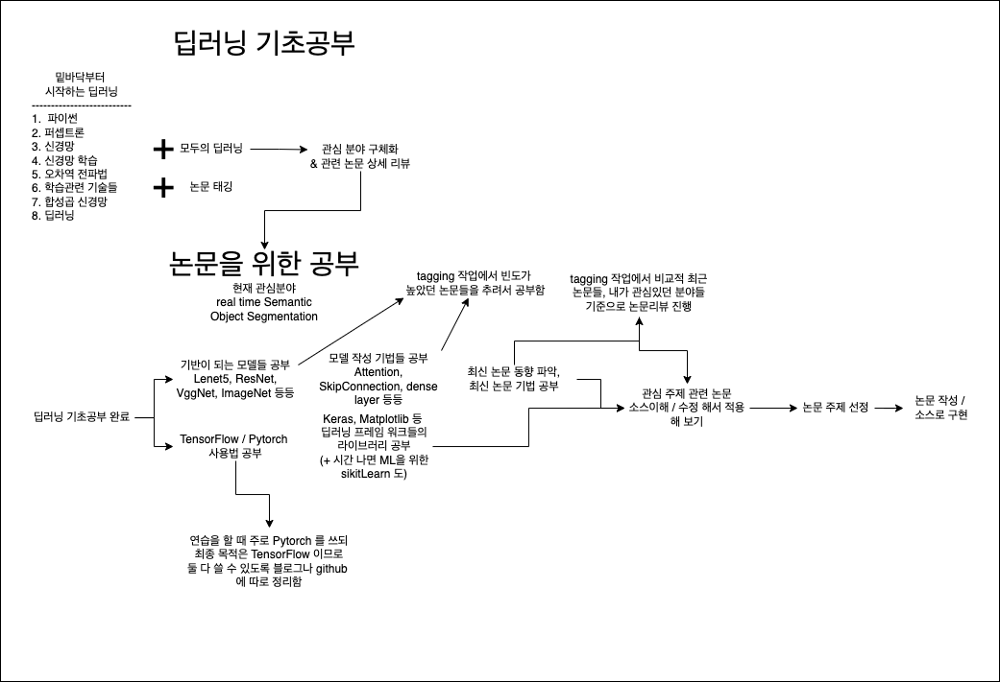

# Deep Learning Study Loadmap

---

## 하고 싶은 것

### 1. Semantic Instance Segmentation 분야

1. Semantic Instance Segmentation
2. real time object detection

> Semantic Instance Segmentation 분야 같은 경우 적용할 수 있는 분야가 넓어서 이 분야를 하고 싶었다. 또한 이 분야 안에서 특히 real time 쪽은 현재 많은 곳에서 연구중인 자율주행(특히 테슬라) 연구가 활발히 진행되는 것으로 알고 있다. 하지만 이 분야는 YOLO 이후 큰 발전이 없고 더 좋은 모델이 나오더라도 YOLO 의 개선버전이 나오면 그 성능이 더 좋았다. 이에 따라 이 분야에 대해 모델 활용 및 한국에서의 적용점에서 개선 방향으로 공부할 것을 생각하고 있다.

### 2. unsupervised learning

> Unsupervised Learning 같은 경우 지나치게 복잡한 현상이나 사람이 분류하기 어려운 상황들을 컴퓨터의 도움을 받아서 작업을 진행하는 것에 매력을 느꼈다. 하지만 아직은 한계가 많다는 말을 들었고 데이터의 분류와 생성 자체가 어려움을 알게 되었다.

---

### 3. 구제적 loadmap

1. 수학공부
1.1. 기초수학(고등과정까지)
1.2. 선형대수학
1.3. 해석학(기초만)
1.4. 정수론
1.5. 확률과 통계

2. 기초 DL 공부
2.1. 강의 & 책
모두의 딥러닝, 밑바닥부터 시작하는 딥러닝
2.2. 밑바닥부터 시작하는 딥러닝
2.3. cv 관련 tagging 작업
2.4. 딥러닝 관련 용어 정리

