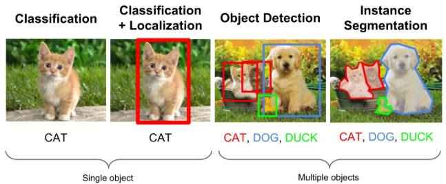
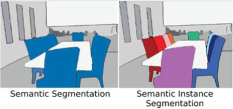
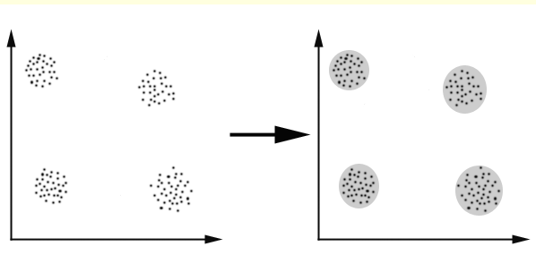

# DL WORD SUMMARY

### 1. CV 의 4가지 과제

cv 에는 아래 4가지 해결해야 할 과제들이 있다. 이 용어들은 논문에서 많이 쓰이는 단어들로 구분을 위해 정리한다.

1. Classification
2. Object Detection
3. Image segmentation
4. Instance Segmentation

- Instance Segmentation 추가 정리
Image segmentation은 이미지의 영역을 분할해서 각 object에 맞게 합쳐주는것을 말한다.

`Image segmentation` 의 대표적인 예로는 `Semantic segmentation`과 `Instance segmentation`이 있다.
위 그림에서 보다시피 `Semantic segmentation`이란 `Object segmentation`을 하되 같은 class인 object들은
같은 영역 혹은 색으로 분할하는 것이다.
반대로 `Instance segmentation`은 같은 class이여도 서로 다른 instance로 구분해주는 것이다.
따라서 object가 겹쳤을때 각각의 object를 구분해주지 못하는 `Semantic segmentation`에서의 문제를
Instance segmentation을 통해 해결할 수 있다.

### 2. Bells and Whistles

부가기능이라는 뜻으로 해석하면 된다. 부가적인 효과, 기대하지 않았던 부수적인 효과들로 봐도 된다.(일반적인 용어이다)

### 3. Clustering

패턴 공간에 주어진 유한 개의 패턴들이 서로 가깝게 모여서 무리를 이루고 있는 패턴집합을 cluster(군집) 이라 하고 그 무리들을 무리지워 나가는 처리과정을 clustering 이라 한다.

[참고 사이트](http://www.aistudy.com/pattern/clustering.htm)

### 4. non-parametric classification
