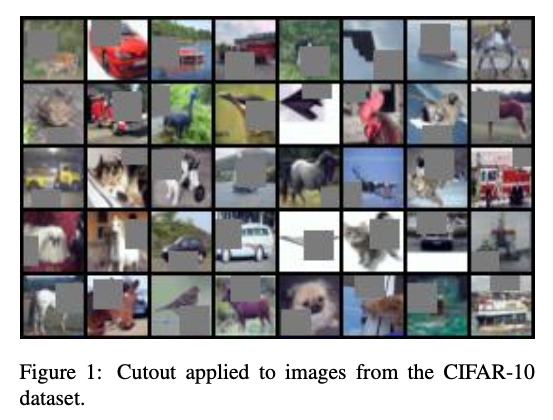
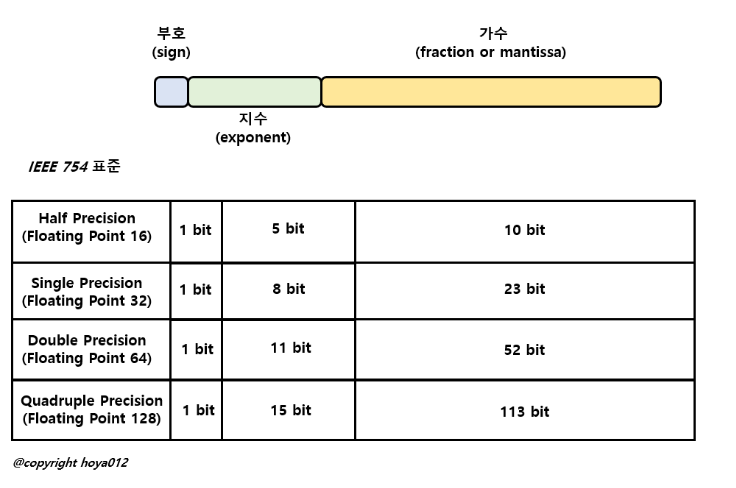

# Paper Review - CV
1. 여기서는 CV 관련한 논물들의 요약과 tagging 을 진행한다.
2. nlp 와 관련된 논문들은 추후 따로 진행할 것이다.

---

### 1. End-to-End Object Detection with Transformers

#### Abstract

We present a new method that views object detection as a direct set prediction problem. Our approach streamlines the detection pipeline, effectively removing the need for many hand-designed compo- nents like a non-maximum suppression procedure or anchor generation that explicitly encode our prior knowledge about the task. The main ingredients of the new framework, called DEtection TRansformer or DETR, are a set-based global loss that forces unique predictions via bi- partite matching, and a transformer encoder-decoder architecture. Given a fixed small set of learned object queries, DETR reasons about the relations of the objects and the global image context to directly output the final set of predictions in parallel. The new model is conceptually simple and does not require a specialized library, unlike many other modern detectors. DETR demonstrates accuracy and run-time perfor- mance on par with the well-established and highly-optimized Faster R- CNN baseline on the challenging COCO object detection dataset. More- over, DETR can be easily generalized to produce panoptic segmentation in a unified manner. We show that it significantly outperforms com- petitive baselines. Training code and pretrained models are available at https://github.com/facebookresearch/detr.

> **요약 :**
DETR 방법에 관한 논문으로써 기존의 Object Detection 과 달리 특별한 라이브러리가 필요 없고 간단한 아키텍처를 제시함

#### tagging

`CV`, `DETR`, `COCO object detection dataset`, `fast R-CNN`, `CVPR`

#### paper link

https://link.springer.com/chapter/10.1007/978-3-030-58452-8_13

---

### 2. UCF101: A Dataset of 101 Human Actions Classes From Videos in The Wild

#### Abstract

We introduce UCF101 which is currently the largest dataset of human actions. It consists of 101 action classes, over 13k clips and 27 hours of video data. The database consists of realistic user-uploaded videos containing cam- era motion and cluttered background. Additionally, we pro- vide baseline action recognition results on this new dataset using standard bag of words approach with overall perfor- mance of 44.5%. To the best of our knowledge, UCF101 is currently the most challenging dataset of actions due to its large number of classes, large number of clips and also unconstrained nature of such clips.

> **요약 :**
실제 카메라로 찍은 영상들 즉 흔들림이나 배경의 이동 등등 사용자가 업로드한 비디오들로 이루어진 DataSet 으로 현재까지 가장 까다로운 dataset 으로 평가된다.

#### tagging

`DataSet`, `Video`, `user upload`

#### paper link

https://arxiv.org/abs/1212.0402

---

### 3. VERY DEEP CONVOLUTIONAL NETWORKS FOR LARGE-SCALE IMAGE RECOGNITION

#### Abstract

In this work we investigate the effect of the convolutional network depth on its accuracy in the large-scale image recognition setting. Our main contribution is a thorough evaluation of networks of increasing depth using an architecture with very small (3 × 3) convolution filters, which shows that a significant improvement on the prior-art configurations can be achieved by pushing the depth to 16–19 weight layers. These findings were the basis of our ImageNet Challenge 2014 submission, where our team secured the first and the second places in the localisa- tion and classification tracks respectively. We also show that our representations generalise well to other datasets, where they achieve state-of-the-art results. We have made our two best-performing ConvNet models publicly available to facili- tate further research on the use of deep visual representations in computer vision.

> **요약 :**
Convolution Network 에서 그 깊이가 정확도에 미치는 영향에 대해 설명한다.
depth를 16 - 19 정도로 깊이를 두었다.

#### tagging

`CNN`, `very deep CNN`, `ICLR`

#### paper link

https://arxiv.org/abs/1409.1556

---

### 4. DenseBox: Unifying Landmark Localization with End to End Object Detection

#### Abstract

How can a single fully convolutional neural network (FCN) perform on object detection? We introduce DenseBox, a unified end-to-end FCN framework that directly predicts bounding boxes and object class confidences through all locations and scales of an image. Our contribution is two-fold. First, we show that a single FCN, if designed and optimized carefully, can detect multiple different objects extremely accurately and efficiently. Second, we show that when incorporating with landmark localization during multi-task learning, DenseBox further improves object detection accuray. We present experimental results on public benchmark datasets including MALF face detection and KITTI car detection, that indicate our DenseBox is the state-of-the-art system for detecting challenging objects such as faces and cars.

> **요약 :**
Single Fully CNN 에서 좋은 설계와 최적화를 통해 효율적으로 감지함
multi-task learning 에서 landmark 의 위치파악가 통합할 때 정확도를 더욱 향상시킴
까다로운 물체를 감별할 때 더욱 좋은 효과를 보임

#### tagging

`End to End Object Detection`, `DenseBox`, `KITTI`, `CNN`, `FCN`

#### paper link

https://arxiv.org/abs/1509.04874

---

### 5. SQUEEZENET: ALEXNET-LEVEL ACCURACY WITH 50X FEWER PARAMETERS AND <0.5MB MODEL SIZE

#### Abstract

Recent research on deep convolutional neural networks (CNNs) has focused pri- marily on improving accuracy. For a given accuracy level, it is typically possi- ble to identify multiple CNN architectures that achieve that accuracy level. With equivalent accuracy, smaller CNN architectures offer at least three advantages: (1) Smaller CNNs require less communication across servers during distributed train- ing. (2) Smaller CNNs require less bandwidth to export a new model from the cloud to an autonomous car. (3) Smaller CNNs are more feasible to deploy on FP- GAs and other hardware with limited memory. To provide all of these advantages, we propose a small CNN architecture called SqueezeNet. SqueezeNet achieves AlexNet-level accuracy on ImageNet with 50x fewer parameters. Additionally, with model compression techniques, we are able to compress SqueezeNet to less than 0.5MB (510× smaller than AlexNet).
The SqueezeNet architecture is available for download here: https://github.com/DeepScale/SqueezeNet

> **요약 :**
CNN 에서 작은 모델은 3가지 이점을 제공한다
첫째 : 분산 학습중 서버간 통신이 적음
둘째 : 자율 자동차로 모델을 내보내는데 대역폭이 덜 필요하다.
셋째 : FP-GA 등 다른 하드웨어에 배포가 용이하다.
이러한 작은 모델을 위해 squeezenet 을 제안한다. 이 모델은 ImageNet 에 비해 50배 적은 매개변수로 AlexNet 수준의 정확도를 보인다.

#### tagging

`CNN`, `SqueezeNet`, `AlexNet`, `ImageNet`, `ICLR`

#### paper link

https://arxiv.org/pdf/1602.07360.pdf

---

### 6. FRACTALNET: ULTRA-DEEP NEURAL NETWORKS WITHOUT RESIDUALS

#### Abstract

We introduce a design strategy for neural network macro-architecture based on self- similarity. Repeated application of a simple expansion rule generates deep networks whose structural layouts are precisely truncated fractals. These networks contain interacting subpaths of different lengths, but do not include any pass-through or residual connections; every internal signal is transformed by a filter and nonlinearity before being seen by subsequent layers. In experiments, fractal networks match the excellent performance of standard residual networks on both CIFAR and ImageNet classification tasks, thereby demonstrating that residual representations may not be fundamental to the success of extremely deep convolutional neural networks. Rather, the key may be the ability to transition, during training, from effectively shallow to deep. We note similarities with student-teacher behavior and develop drop-path, a natural extension of dropout, to regularize co-adaptation of subpaths in fractal architectures. Such regularization allows extraction of high- performance fixed-depth subnetworks. Additionally, fractal networks exhibit an anytime property: shallow subnetworks provide a quick answer, while deeper subnetworks, with higher latency, provide a more accurate answer.

> **요약 :**
자기 유사성을 기반으로 한 neural network 매크로 아키텍처 설계를 소개한다. 단순 확장을 반복 적용시 그 구조는 프렉탈을 띄게 된다. 이러한 네트워크는 pass-through 나 residual connection 은 포함하지 않는다.(여기서 residual connection 은 resnet 구조를 의미)
이러한 아키텍처는 얕은 하위 네트워크는 빠른 답변을 제공, 깊은 네트워크는 더 정확한 답을 제시한다.

#### tagging

`NN`, `residual connection`, `pass-through`, `CIFAR`, `ImageNet`, `ICLR`

#### paper link

https://arxiv.org/abs/1605.07648

---

### 7. SGDR: STOCHASTIC GRADIENT DESCENT WITH WARM RESTARTS

#### Abstract

Restart techniques are common in gradient-free optimization to deal with multi- modal functions. Partial warm restarts are also gaining popularity in gradient- based optimization to improve the rate of convergence in accelerated gradient schemes to deal with ill-conditioned functions. In this paper, we propose a sim- ple warm restart technique for stochastic gradient descent to improve its anytime performance when training deep neural networks. We empirically study its per- formance on the CIFAR-10 and CIFAR-100 datasets, where we demonstrate new state-of-the-art results at 3.14% and 16.21%, respectively. We also demonstrate its advantages on a dataset of EEG recordings and on a downsampled version of the ImageNet dataset. Our source code is available at https://github.com/loshchil/SGDR

> **요약 :**
partial warm restarts 에 관한 논문이다.
확률적 경사하강법을 위한 warm restarts 를 제안하는 데 CIFAR10, CIFAR100 데이터셋에서 각각 3.14%, 16.21% 를 개선했다.

#### tagging

`warm-restarts`, `gradient-descent`, `CIFAR10`, `CIFAR100`, `ImageNet`

#### paper link

https://arxiv.org/abs/1608.03983

---

### 8. HYPERNETWORKS

#### Abstract

This work explores hypernetworks: an approach of using a one network, also known as a hypernetwork, to generate the weights for another network. Hypernet- works provide an abstraction that is similar to what is found in nature: the relation- ship between a genotype – the hypernetwork – and a phenotype – the main net- work. Though they are also reminiscent of HyperNEAT in evolution, our hyper- networks are trained end-to-end with backpropagation and thus are usually faster. The focus of this work is to make hypernetworks useful for deep convolutional networks and long recurrent networks, where hypernetworks can be viewed as re- laxed form of weight-sharing across layers. Our main result is that hypernetworks can generate non-shared weights for LSTM and achieve near state-of-the-art re- sults on a variety of sequence modelling tasks including character-level language modelling, handwriting generation and neural machine translation, challenging the weight-sharing paradigm for recurrent networks. Our results also show that hypernetworks applied to convolutional networks still achieve respectable results for image recognition tasks compared to state-of-the-art baseline models while requiring fewer learnable parameters.

> **요약 :**
Hypernetworks 는 하나의 네트워크를 사용하여 다른 네트워크의 가중치를 생성하는 기법이다,
하이퍼 네트워크는 자연에서 발견되는 것과 유사한 abstraction 을 제공한다.
DNN 과 long-current-network 를 유용하게 만들며 계층간 가중치 공유의 느슨한 형태 제공.

#### tagging

`nlp(?)`, `end to end`, `DNN`, `LSTM`, `back propagation`

#### paper link

https://arxiv.org/abs/1609.09106

---

### 9. Beyond Skip Connections: Top-Down Modulation for Object Detection

#### Abstract

In recent years, we have seen tremendous progress in the field of object detection. Most of the recent improvements have been achieved by targeting deeper feedforward net- works. However, many hard object categories such as bot- tle, remote, etc. require representation of fine details and not just coarse, semantic representations. But most of these fine details are lost in the early convolutional layers. What we need is a way to incorporate finer details from lower lay- ers into the detection architecture. Skip connections have been proposed to combine high-level and low-level features, but we argue that selecting the right features from low-level requires top-down contextual information. Inspired by the human visual pathway, in this paper we propose top-down modulations as a way to incorporate fine details into the de- tection framework. Our approach supplements the standard bottom-up, feedforward ConvNet with a top-down modula- tion (TDM) network, connected using lateral connections. These connections are responsible for the modulation of lower layer filters, and the top-down network handles the selection and integration of contextual information and low- level features. The proposed TDM architecture provides a significant boost on the COCO benchmark, achieving 28.6 AP for VGG16 and 35.2 AP for ResNet101 networks. Us- ing InceptionResNetv2, our TDM model achieves 37.3 AP, which is the best single-model performance to-date on the COCO testdev benchmark, without any bells and whistles.

> **요약 :**
skip connection 은 초기 Convolution Layer 에서 소실되는 미세한 정보들을 상위 레이어와 하위 레이어를 통합하는 방식으로 개선했다. 이 논문에서는 이 통합과정에서 하위 레이어의 올바른 선택을 하는 방법을 제시한다.

#### tagging

`CNN`, `Skip Connection`, `TDM`, `COCO benchmark`, `VGG16`, `ResNet101`

#### paper link

https://arxiv.org/abs/1612.06851

---

### 10. Label Refinement Network for Coarse-to-Fine Semantic Segmentation

#### Abstract

We consider the problem of semantic image segmentation using deep convolutional neural networks. We propose a novel network architecture called the label refinement net- work that predicts segmentation labels in a coarse-to-fine fashion at several resolutions. The segmentation labels at a coarse resolution are used together with convolutional fea- tures to obtain finer resolution segmentation labels. We de- fine loss functions at several stages in the network to provide supervisions at different stages. Our experimental results on several standard datasets demonstrate that the proposed model provides an effective way of producing pixel-wise dense image labeling.

> **요약 :**
CNN 모델에서 Label Refinement Network 를 제시한다. 이는 네트워크의 여러 단계에서 loss function 을 정의하여 각각의 단계에서 다른 supervision 을 제시한다.

#### tagging

`CNN`, `Label Refinement Network`, `loss function`, `Segmentation Label`

#### paper link

https://arxiv.org/abs/1703.00551

---

### 11. Semantic Instance Segmentation via Deep Metric Learning

#### Abstract

We propose a new method for semantic instance segmen- tation, by first computing how likely two pixels are to be- long to the same object, and then by grouping similar pixels together. Our similarity metric is based on a deep, fully convolutional embedding model. Our grouping method is based on selecting all points that are sufficiently similar to a set of “seed points’, chosen from a deep, fully convolu- tional scoring model. We show competitive results on the Pascal VOC instance segmentation benchmark.

> **요약 :**
 두 픽셀이 하나의 객체에 속할 가능성을 계산 하여 유사한 픽셀들을 그룹화 하는 방식을 제시한다. 이것은 similarity metric는 deep fully convolution embeded 모델을 기반으로 하며 pascal VOC 벤치마크에서 유의미한 결과를 보여준다.

#### tagging

`similarity metric`, `CNN`, `pascal VOC benchmark`, `deep fully convolution embed model`

#### paper link

https://arxiv.org/abs/1703.10277

---

### 12. MobileNets: Efficient Convolutional Neural Networks for Mobile Vision Applications

#### Abstract

We present a class of efficient models called MobileNets for mobile and embedded vision applications. MobileNets are based on a streamlined architecture that uses depth- wise separable convolutions to build light weight deep neural networks. We introduce two simple global hyper-parameters that efficiently trade off between latency and accuracy. These hyper-parameters allow the model builder to choose the right sized model for their application based on the constraints of the problem. We present extensive experiments on resource and accuracy tradeoffs and show strong performance compared to other popular models on ImageNet classification. We then demonstrate the effectiveness of MobileNets across a wide range of applications and use cases including object detection, finegrain classification, face attributes and large scale geo-localization.

> **요약 :**
모바일 및 임베디드 비전 어플리케이션을 위한 MobileNet 이라는 모델을 제시한다. MobileNet 은 분리가능한 Convolution 을 사용하여 Deep Neural Network 의 간소화 아키텍처를 기반으로 한다. 지연시간과 정확성을 효율적으로 절충하는 2가지 매개변수를 소개한다.

#### tagging

`MobileNet`, `DNN`, `ImageNet`, `hyper parameters` `object detection`, `finegrain classification`, `face attributes`, `large scale geolocalization`

#### paper link

https://arxiv.org/abs/1704.04861

---

### 13. VSE++: Improving Visual-Semantic Embeddings with Hard Negatives

#### Abstract

We present a new technique for learning visual-semantic embeddings for cross-modal retrieval. Inspired by hard negative mining, the use of hard negatives in structured pre- diction, and ranking loss functions, we introduce a simple change to common loss func- tions used for multi-modal embeddings. That, combined with fine-tuning and use of augmented data, yields significant gains in retrieval performance. We showcase our approach, VSE++, on MS-COCO and Flickr30K datasets, using ablation studies and comparisons with existing methods. On MS-COCO our approach outperforms state-of- the-art methods by 8.8% in caption retrieval and 11.3% in image retrieval (at R@1).

> **요약 :**
교차모드 검색을 위한 기술로 hard negative mining 에 영감을 받아 loss-function 에 약간의 변경을 소개한다.

#### tagging

`loss function`, `MS-COCO DataSet`, `Flickr30K DataSet`,

#### paper link

https://arxiv.org/abs/1707.05612

---

### 14. Semantic Instance Segmentation with a Discriminative Loss Function

#### Abstract

Semantic instance segmentation remains a challenging task. In this work we propose to tackle the problem with a discriminative loss function, operating at the pixel level, that encourages a convolutional network to produce a representation of the image that can easily be clustered into instances with a simple post-processing step. The loss function encourages the network to map each pixel to a point in feature space so that pixels belonging to the same in- stance lie close together while different instances are separated by a wide margin. Our approach of combining an off-the-shelf network with a principled loss function inspired by a metric learning objective is conceptually simple and distinct from recent efforts in instance segmentation. In contrast to previous works, our method does not rely on object proposals or recurrent mechanisms. A key contribution of our work is to demonstrate that such a simple setup without bells and whistles is effective and can perform on-par with more complex methods. Moreover, we show that it does not suffer from some of the limitations of the popular detect-and-segment approaches. We achieve competitive performance on the Cityscapes and CVPPP leaf segmentation benchmarks.

> **요약 :**
간단한 후처리 단계를 추가함으로써 클러스터링(군집화)을 더 쉽게 할 수 있는 방법을 제시한다.

#### tagging

`Semantic instance segmentation`, `post process(후처리)`, `CVPPP leaf segmentation benchmarks`, `cv`

#### paper link

https://arxiv.org/abs/1708.02551

---

### 15. Improved Regularization of Convolutional Neural Networks with Cutout

#### Abstract

Convolutional neural networks are capable of learning powerful representational spaces, which are necessary for tackling complex learning tasks. However, due to the model capacity required to capture such representations, they are often susceptible to overfitting and therefore require proper regularization in order to generalize well.
In this paper, we show that the simple regularization technique of randomly masking out square regions of input during training, which we call cutout, can be used to improve the robustness and overall performance of convolutional neural networks. Not only is this method extremely easy to implement, but we also demonstrate that it can be used in conjunction with existing forms of data augmentation and other regularizers to further improve model performance. We evaluate this method by applying it to current state-of-the-art architectures on the CIFAR- 10, CIFAR-100, and SVHN datasets, yielding new state-of- the-art results of 2.56%, 15.20%, and 1.30% test error respectively. Code available at https://github.com/ uoguelphmlrg/Cutout.

> **요약 :**
CNN 기반의 모델들에서 발생하는 과적합에 대한 해결책으로 cutout 을 제시한다.

> **추가설명 :**
일반적인 Img 데이터에서 랜덤하게 직사각형의 공간을 0 으로 채워버린다.

[참고링크](https://blog.naver.com/PostView.nhn?isHttpsRedirect=true&blogId=sogangori&logNo=221091518432&parentCategoryNo=&categoryNo=&viewDate=&isShowPopularPosts=false&from=postView)

#### tagging

`CNN`, `CUTOUT`, `CIFAR10`, `overfitting`, `regularization`

#### paper link

https://arxiv.org/abs/1708.04552

---

### 16. Mixed Precision Training

#### Abstract

Increasing the size of a neural network typically improves accuracy but also in- creases the memory and compute requirements for training the model. We intro- duce methodology for training deep neural networks using half-precision float- ing point numbers, without losing model accuracy or having to modify hyper- parameters. This nearly halves memory requirements and, on recent GPUs, speeds up arithmetic. Weights, activations, and gradients are stored in IEEE half- precision format. Since this format has a narrower range than single-precision we propose three techniques for preventing the loss of critical information. Firstly, we recommend maintaining a single-precision copy of weights that accumulates the gradients after each optimizer step (this copy is rounded to half-precision for the forward- and back-propagation). Secondly, we propose loss-scaling to pre- serve gradient values with small magnitudes. Thirdly, we use half-precision arith- metic that accumulates into single-precision outputs, which are converted to half- precision before storing to memory. We demonstrate that the proposed methodol- ogy works across a wide variety of tasks and modern large scale (exceeding 100 million parameters) model architectures, trained on large datasets.

> **요약 :**
NN 의 크기를 키우는 것이 일반적으로 정확도를 높이긴 하지만 컴퓨팅 요구 사항도 증가한다. 이에 모델 정확도를 잃거나 hyper parameters 를 건드리지 않고  half-precision floating point numbers 를 이용하여 심층학습을 진행하는 것을 제안한다.

> **추가 설명 :**
부동소수점 연산에서 IEEE 에서 표준으로 제시한 FP32 가 아닌 FP16 으로 연산을 진행하는 것이다. 밑의 그림 참조

#### tagging

`CNN`, `IEEE FP32`, `floating point number`

#### paper link

https://arxiv.org/abs/1710.03740

---

### 17. SEARCHING FOR ACTIVATION FUNCTIONS

#### Abstract

The choice of activation functions in deep networks has a significant effect on the training dynamics and task performance. Currently, the most successful and widely-used activation function is the Rectified Linear Unit (ReLU). Although various hand-designed alternatives to ReLU have been proposed, none have man- aged to replace it due to inconsistent gains. In this work, we propose to lever- age automatic search techniques to discover new activation functions. Using a combination of exhaustive and reinforcement learning-based search, we dis- cover multiple novel activation functions. We verify the effectiveness of the searches by conducting an empirical evaluation with the best discovered activation function. Our experiments show that the best discovered activation function, f(x) = x · sigmoid(βx), which we name Swish, tends to work better than ReLU on deeper models across a number of challenging datasets. For example, simply replacing ReLUs with Swish units improves top-1 classification accuracy on Im- ageNet by 0.9% for Mobile NASNet-A and 0.6% for Inception-ResNet-v2. The simplicity of Swish and its similarity to ReLU make it easy for practitioners to replace ReLUs with Swish units in any neural network.

> **요약 :**
sigmoid function 에서 보편적으로 사용되는 것은 ReLU 이다. 이 논문에서는 ReLU 와 유사한 형태이지만 더 까다로운 데이터셋, 더 깊은 NN 에서 더 좋은 성능을 보이는 swish 라는 activate function 을 제시한다.

> **추가 설명 :**
$f(x) = x * sigmoid(\beta x)$
$sigmoid(\beta x) = {1 \over 1+e^{-\beta x}}$

#### tagging

`Activate Function`, `ReLU`, `Sigmoid Function`, `ageNet`, `NASNet-A`, `Inception-ResNet-v2`

#### paper link
https://arxiv.org/abs/1710.05941

---

### 18. mixup: BEYOND EMPIRICAL RISK MINIMIZATION

#### Abstract

Large deep neural networks are powerful, but exhibit undesirable behaviors such as memorization and sensitivity to adversarial examples. In this work, we propose mixup, a simple learning principle to alleviate these issues. In essence, mixup trains a neural network on convex combinations of pairs of examples and their labels. By doing so, mixup regularizes the neural network to favor simple linear behavior in-between training examples. Our experiments on the ImageNet-2012, CIFAR-10, CIFAR-100, Google commands and UCI datasets show that mixup improves the generalization of state-of-the-art neural network architectures. We also find that mixup reduces the memorization of corrupt labels, increases the robustness to adversarial examples, and stabilizes the training of generative adversarial networks.

> **요약 :**
크기가 큰 Neural Network 는 powerful 하다. 하지만 적대적인 사례에 대한 memorization 과 sensitivity 가 생기는 문제가 있다. 이러한 문제를 완화하기 위해 mixup 을 제시한다.

#### tagging

`mixup`, `DNN`, `ImageNet-2012`, `CIFAR10`, `CIFAR100`, `Google Command`, `UCI DataSet`

#### paper link

https://arxiv.org/abs/1710.09412

---

### 19.

#### Abstract

#### tagging

#### paper link

https://arxiv.org/abs/1711.02281

---

### 20.

#### Abstract

#### tagging

#### paper link
